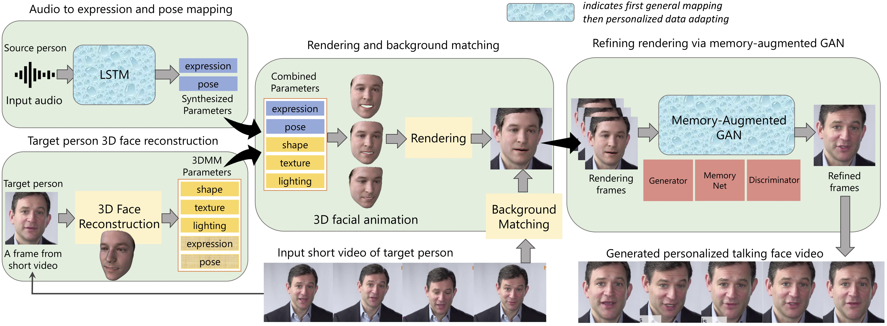

# Audio-driven Talking Face Video Generation with Learning-based Personalized Head Pose

We provide PyTorch implementations for our arxiv paper "Audio-driven Talking Face Video Generation with Learning-based Personalized Head Pose"(http://arxiv.org/abs/2002.10137), and our IEEE TMM paper "Predicting Personalized Head Movement From Short Video and Speech Signal" (https://ieeexplore.ieee.org/document/9894719).

Note that this code is protected under patent. It is for research purposes only at your university (research institution) only. If you are interested in business purposes/for-profit use, please contact Prof.Liu (the corresponding author, email: liuyongjin@tsinghua.edu.cn).

We provide a demo video [here](https://cg.cs.tsinghua.edu.cn/people/~Yongjin/Yongjin.htm) (please search for "Talking Face" in this page and click the "demo video" button).

[Colab](https://colab.research.google.com/drive/1gqcqTSAGAyj48n0fmApvSPG_43BzKP37)

## Our Proposed Framework



## Prerequisites
- Linux or macOS
- NVIDIA GPU
- Python 3
- MATLAB

## Getting Started
### Installation
- You can create a virtual env, and install all the dependencies by
```bash
pip install -r requirements.txt
```

### Download pre-trained models
- Including pre-trained general models and models needed for face reconstruction, identity feature extraction etc
- Download from [BaiduYun](https://pan.baidu.com/s/14-M5TQhNc24275W1ez-gJw)(extract code:usdm) or [GoogleDrive](https://drive.google.com/file/d/17xMNjNEsM0DhS9SKDdUQue0wlbz4Ww9o) and copy to corresponding subfolders (Audio, Deep3DFaceReconstruction, render-to-video).

### Download face model for 3d face reconstruction
- Download Basel Face Model from [https://faces.dmi.unibas.ch/bfm/main.php?nav=1-0&id=basel_face_model](https://faces.dmi.unibas.ch/bfm/main.php?nav=1-0&id=basel_face_model), and copy `01_MorphableModel.mat` to `Deep3DFaceReconstruction/BFM` folder
- Download Expression Basis from CoarseData of [Guo et al.](https://github.com/Juyong/3DFace), and copy `Exp_Pca.bin` to `Deep3DFaceReconstruction/BFM` folder

### Fine-tune on a target peron's short video
- 1. Prepare a talking face video that satisfies: 1) contains a single person, 2) 25 fps, 3) longer than 12 seconds, 4) without large body translation (e.g. move from the left to the right of the screen). An example is [here](Data/31.mp4). Rename the video to [person_id].mp4 (e.g. 1.mp4) and copy to Data subfolder.

Note: You can make a video to 25 fps by 
```bash
ffmpeg -i xxx.mp4 -r 25 xxx1.mp4
```
- 2. Extract frames and lanmarks by
```bash
cd Data/
python extract_frame1.py [person_id].mp4
```
- 3. Conduct 3D face reconstruction. First should compile code in `Deep3DFaceReconstruction/tf_mesh_renderer/mesh_renderer/kernels` to .so, following its [readme](Deep3DFaceReconstruction/tf_mesh_renderer/README.md), and modify line 28 in [rasterize_triangles.py](Deep3DFaceReconstruction/tf_mesh_renderer/mesh_renderer/rasterize_triangles.py) to your directory. Then run
```bash
cd Deep3DFaceReconstruction/
CUDA_VISIBLE_DEVICES=0 python demo_19news.py ../Data/[person_id]
```
This process takes about 2 minutes on a Titan Xp.
- 4. Fine-tune the audio network. First modify line 28 in [rasterize_triangles.py](Audio/code/mesh_renderer/rasterize_triangles.py) to your directory. Then run
```bash
cd Audio/code/
python train_19news_1.py [person_id] [gpu_id]
```
The saved models are in `Audio/model/atcnet_pose0_con3/[person_id]`.
This process takes about 5 minutes on a Titan Xp.
- 5. Fine-tune the gan network.
Run
```bash
cd render-to-video/
python train_19news_1.py [person_id] [gpu_id]
```
The saved models are in `render-to-video/checkpoints/memory_seq_p2p/[person_id]`.
This process takes about 40 minutes on a Titan Xp.


### Test on a target peron
Place the audio file (.wav or .mp3) for test under `Audio/audio/`.
Run [with generated poses]
```bash
cd Audio/code/
python test_personalized.py [audio] [person_id] [gpu_id]
```
or [with poses from short video]
```bash
cd Audio/code/
python test_personalized2.py [audio] [person_id] [gpu_id]
```
This program will print 'saved to xxx.mov' if the videos are successfully generated.
It will output 2 movs, one is a video with face only (_full9.mov), the other is a video with background (_transbigbg.mov).

## Colab
A colab demo is [here](https://colab.research.google.com/drive/1gqcqTSAGAyj48n0fmApvSPG_43BzKP37).

## Citation
If you use this code for your research, please cite our papers:

```
@article{yi2020audio,
  title     = {Audio-driven talking face video generation with learning-based personalized head pose},
  author    = {Yi, Ran and Ye, Zipeng and Zhang, Juyong and Bao, Hujun and Liu, Yong-Jin},
  journal   = {arXiv preprint arXiv:2002.10137},
  year      = {2020}
}
```
```
@article{YiYSZZWBL22,
  title     = {Predicting Personalized Head Movement From Short Video and Speech Signal},
  author    = {Yi, Ran and Ye, Zipeng and Sun, Zhiyao and Zhang, Juyong and Zhang, Guoxin and Wan, Pengfei and Bao, Hujun and Liu, Yong-Jin},
  journal   = {IEEE Transactions on Multimedia}, 
  volume    = {},
  number    = {},
  pages     = {1-13},
  doi       = {10.1109/TMM.2022.3207606}
}
```

## Acknowledgments
The face reconstruction code is from [Deep3DFaceReconstruction](https://github.com/microsoft/Deep3DFaceReconstruction), the arcface code is from [insightface](https://github.com/deepinsight/insightface), the gan code is developed based on [pytorch-CycleGAN-and-pix2pix](https://github.com/junyanz/pytorch-CycleGAN-and-pix2pix).